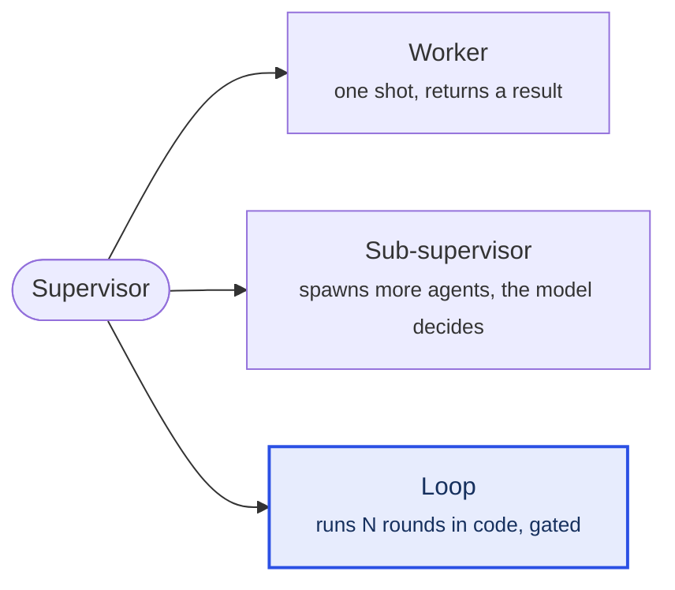
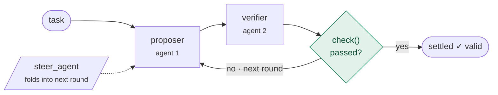

# The loop atom

> A **loop** is the third thing a supervisor can spawn — a child that repeats
> `try → check → try again` until a real test passes, with the repeating written
> in **code** (bounded rounds, a conserved budget, a gate), not left to a model's
> judgment. It is spawned, observed, and steered exactly like a worker.

## What a supervisor can spawn

A supervisor hands out work by spawning children. There are now three shapes, all
spawned with the same verb and all steerable mid-run:



| Shape | Runs | Who decides "keep going / stop" |
|---|---|---|
| **Worker** | once | n/a — one pass, then it settles |
| **Sub-supervisor** | many rounds | the model's judgment |
| **Loop** *(new)* | up to `maxRounds` | **code** — the runtime enforces it |

Before the loop atom, "loop until it's good" only existed *inside* a
sub-supervisor's reasoning: unbounded, able to overspend, able to skip the check.
The loop atom makes that a real, spawnable child with the budget and the gate
enforced.

## Inside a loop

Each round runs the loop's body; after each round the runtime polls the `check`
and stops the instant it passes (or when `maxRounds` is hit). A supervisor's
`steer_agent` message folds into the next round.



The runtime — not the authored body — guarantees three things:

- **Bounded** — at most `maxRounds`, and the run-wide conserved pool fails a spawn
  closed at any depth, so a loop can never overspend the ceiling.
- **Gated** — it settles `valid` **only if** `check(out)` passes. Run out of
  rounds without delivering and it settles `valid: false`.
- **Steerable** — `steer_agent → Scope.send → deliver`; queued between rounds.

## Write a loop

Author a `LoopDef`, then hand it to `loopChild`. Two forms — pick one:

```ts
import { defineLoop, loopChild } from '@tangle-network/agent-runtime/loops'

// (a) freeform: write the whole round yourself (any topology, spawn children, branch).
const refine = defineLoop('refine', {
  maxRounds: 4,
  round: async ({ scope, steer }) => {
    const w = scope.spawn(worker, { steer }, { budget: perRound, label: 'try' })
    if (!w.ok) throw new Error(w.reason)
    return { out: await scope.next() }
  },
  check: (out) => testsPass(out),
})

// (b) declarative multi-agent: an ordered CHAIN of named agents piped each round.
//     "Two agents" is self-evident from the list — no bespoke `runTwoAgent…` function.
const research = defineLoop('research', {
  maxRounds: 3,
  agents: [proposer, verifier],        // task → proposer → verifier → out
  check: (out) => readinessPasses(out),
})
```

The `agents` form is a **sequential chain** (each agent's output feeds the next).
It is deliberately *not* parallel: the loop's `scope.next()` is one shared queue,
so parallel agents would steal each other's settlements. For fan-out or dynamic
routing use the freeform `round`.

## Spawn a loop

Wire the executor once, then spawn the loop like any child:

```ts
const run = createInMemoryRunContext({ withDriver: true, withLoop: true })
// inside a driver's act(task, scope):
const r = scope.spawn(loopChild(research, run.journal), task, { budget, label: 'research-loop' })
// observe it, steer_agent it, stop it — same coordination surface as a worker.
```

## Why this isn't `loopUntil` / `pipeline` / `defineStrategy`

Those return a **run *shape*** (`CombinatorShape` / `Strategy`) you hand to
`runPersonified` / `runBenchmark` as the shape of a *whole run*. They are not
`Agent`s, so a driver **cannot spawn one as a child** and cannot `steer_agent` it.

`defineLoop` + `loopChild` produce an `Agent` → a spawnable `role: 'loop'`
executor — a **child** spawned mid-run, observable and steerable, on the same
conserved budget and depth ceiling. Same "loop until good" intent, different
layer: a shape is the root of a run; the loop atom is a child of one.

---

**One line to remember:** a loop is a sub-supervisor whose *keep going / stop /
passed?* is written in code, not left to the model's judgment.

*Source: `src/runtime/supervise/loop-executor.ts` (the executor + `defineLoop`).
See also the decision-table row in [`canonical-api.md`](./canonical-api.md).*
