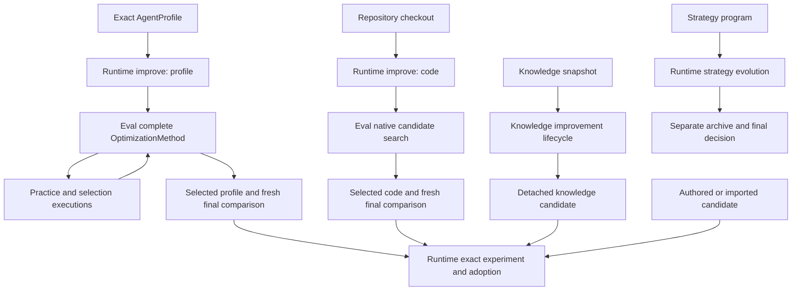
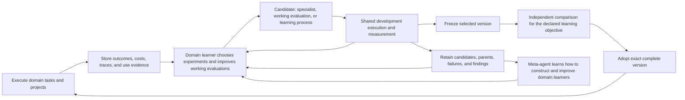

# Learning system audit: Runtime, Eval, and Knowledge

**Verdict: make the learning process itself a first-class object, with separate evidence for specialist quality, domain learning, evaluation quality, and meta-learning.**
The audit reproduced wrong candidate decisions and disconnected research feedback on the current main branches.
These failures justify repairs to the existing paths.
They do not justify reducing the ambition to prompt tuning or rejecting learning across projects.

The target includes specialized agents, repeatable learning within a domain, and agents that improve how those specialists are discovered and trained.
Its changing state includes instructions, tools, code, knowledge, coordination, resource decisions, and the procedure that changes those parts.
A specialist can succeed within its intended domain without generalizing beyond it.
The transferable result can instead be the procedure that constructs a successful learning process in a new domain.
Cross-domain transfer is a further objective, not the sole definition of success.

## Method and evidence boundary

The audit fetched all three main branches before creating isolated checkouts.
Source references below describe these exact starting revisions unless a repair is explicitly named.

| Repository | Audited main | Package version |
| --- | --- | --- |
| [agent-runtime](https://github.com/tangle-network/agent-runtime/tree/a16d8a3b91481b140cb552e373d5bde98b34af05) | `a16d8a3b91481b140cb552e373d5bde98b34af05` | `0.193.1` |
| [agent-eval](https://github.com/tangle-network/agent-eval/tree/f8e3da285b6286386699a196733e9c0c27c20cfd) | `f8e3da285b6286386699a196733e9c0c27c20cfd` | `0.173.3` |
| [agent-knowledge](https://github.com/tangle-network/agent-knowledge/tree/390f2da9883e55cc86a8985167324d8b1f10894a) | `390f2da9883e55cc86a8985167324d8b1f10894a` | `13.0.1` |

Runtime main advanced to `bd7a2f3f15a93ee286684c5bc6b88c00df9b72de` during the audit.
The repair branch includes that change, including profile-owned recursive authority and durable acceptance of direct submissions.
The source findings below retain their original revision boundary.
The final integration checks use the combined implementation.

`R`, `E`, and `K` in source references mean these Runtime, Eval, and Knowledge revisions.
Runtime coverage includes all 24 production files under `src/improvement`, plus execution, adoption, strategy evolution, observation, and memory serving.
Eval coverage includes native search, complete methods, Python adapters, final comparisons, provenance, costs, and related learning utilities.
Knowledge coverage includes KB candidates, retrieval, memory experiments, research loops, source evidence, and Runtime composition.
Public callsites and nearby applications were searched to distinguish implemented APIs from demonstrated adoption.

Defect probes used real public functions with deterministic callbacks, real Git worktrees, and real filesystem storage.
KB snapshot probes ran in a local Linux container because the exact snapshot implementation intentionally refuses macOS.
These tests measure implementation behavior, not model intelligence or defect prevalence.
No paid model experiment, production deployment, or current same-task comparison against another learning system ran during this audit.

Primary research was checked through paper abstracts, official repository documentation, package metadata, and selected implementation contracts.
This is a mechanism comparison, not a systematic literature review or a benchmark ranking.
Upstream performance claims were not independently reproduced and are not assigned to this system.

## What the system must learn

Different outcomes currently share the word “improvement.”
They need distinct evidence even when they use the same execution and storage components.

| Outcome | Example | Evidence that would establish it |
| --- | --- | --- |
| Better work within one task | Diagnose a failed test, change code, and finish correctly | A checked final result and the actual resources consumed |
| Better domain specialist | Improve an `AgentProfile` for a defined task family | Improvement on fresh tasks within that domain; cross-domain performance is optional |
| Better domain learning process | Repeatedly discover better specialists across rollouts and objectives | Continued useful gains and retained ability under the declared domain objectives and resources |
| Useful accumulated knowledge | Reuse a discovery when solving a different project | Retrieval/use records joined to later task outcomes, with retention and transfer checks |
| Better evaluation engineering | Generate cases or checks that expose failures the prior evaluation missed | Better agreement with independently established outcomes, coverage, discrimination, and resistance to easy exploits |
| Better learning itself | Change how experiments are selected, interpreted, or consolidated | A changed learner produces better specialists or domain learning processes across repeated trials |
| Transfer of learning procedure | Construct a working learning process in a new domain | The learned procedure produces better domain specialists than the declared alternative there |

An optimizer selecting a new prompt establishes none of these outcomes by itself.
A record in a lesson store establishes that text was retained.
A knowledge page with a citation establishes a provenance relationship.
Each can be useful without constituting a demonstrated capability gain.

The ambition should include searching over the whole executable agent and its learning procedure.
The candidate may add a tool, reorganize work, change memory access, retain a useful result, or replace the search method.
Different interventions can require each other to produce value.
For example, retaining a research result helps only if later planning retrieves and uses it.
Testing each component alone cannot reject the combined mechanism.

Search should retain informative failures and promising alternatives even when they are unsuitable for immediate adoption.
Requiring every exploratory step to improve a short-run scalar would prevent some useful discoveries.
Adopting an active version remains a separate decision with an explicit outcome and resource policy.
That distinction permits broad exploration without turning an unsupported claim into a deployed improvement.

### The domain learning process is a reusable artifact

A domain learner takes a domain objective, available execution tools, current specialists, prior experience, and resources.
It produces evaluated specialist candidates, improved working evaluations, experiment records, and an updated learning state.
Its behavior includes which problems to generate, what to change, how to measure it, and when to change the learning strategy.
This is a richer object than one call that improves one profile on fixed cases.

The meta-agent can learn to construct and run that process repeatedly.
What transfers might be an evaluation-design tactic, a curriculum, a diagnosis method, an experimental policy, or a complete executable learning procedure.
The resulting specialists may remain entirely domain-specific.
Transfer of specialist behavior and transfer of the procedure that trains specialists require different experiments.

There are therefore at least three changeable artifacts: the specialist, the working evaluation, and the learning policy.
They can improve together, but they should not collapse into one ambiguous score.
An evaluation candidate is valuable when it better detects meaningful success and failure, even if it lowers the current specialist's measured score.
A learning-policy candidate is valuable when it produces better subsequent learning, even if its own first specialist is weaker.
Within-domain improvement is also valuable when neither artifact transfers elsewhere.

Automated evaluation hill climbing should target evaluation quality and downstream learning quality.
Optimizing the current specialist's score by weakening its tests would measure a different, undesirable objective.
Independent outcomes, fresh failure cases, controlled defects, and external assessment can test evaluation changes.
The working evaluation can evolve; its authority to declare its own success must remain bounded by evidence outside that optimization.

## What `improve(...)` actually does

The Runtime name covers two different execution paths.
Knowledge improvement has another public entry point.
The profile surfaces already share a method implementation; they are not nine independently written optimizers.

The arrows into exact experiments require caller composition.
They do not imply that every API automatically shares execution records or deployment state.

### Profile improvement

`R:src/improvement/method-execution.ts:291` parses and freezes the full baseline profile, then extracts the requested change surface.
The selected complete `OptimizationMethod` owns search and candidate selection.
Its inputs include disjoint practice and selection cases; final cases remain outside its input.
Each proposed value is materialized back into a full immutable profile before the caller executes it.
The result contains the selected candidate, final uncertainty, cost, task identities, and the candidate population when the method supplies it.

This is a useful bounded experiment.
The call does not choose the next research question, query accumulated experience, schedule the next experiment, or deploy its result.
It does not establish that the learning method improved.
The profile path requires complete reported cost and a positive lower confidence bound beyond the configured minimum lift for `ship`.
That policy answers a particular scalar comparison; it is not a universal definition of progress toward the broader product objective.

### Code improvement

`R:src/improvement/code-execution.ts:167` creates an isolated baseline checkout and supplies a code generator to Eval's native search.
Later generations inherit the accepted incumbent code, and returned code includes its full difference from the original baseline.
The default generator executes a supplied coding-agent profile.
It can use failure summaries or raw trace paths and retain its best checked attempt.
Rejected worktrees are removed; the caller disposes the returned worktree when finished.

Runtime ownership of worktrees is appropriate.
Separate representations of final evidence, cost, resume identity, and adoption are not inherent requirements of code search.
The code result also has narrower lineage fields than the profile result.
The exact-code bundle builder already verifies and embeds the finalized patch bytes.

### Surfaces and their actual reach

| Surface | Value searched | What changes | Boundary or limitation |
| --- | --- | --- | --- |
| `prompt` | String | `prompt.systemPrompt` | Does not include every instruction field |
| `skills` | One inline document | One named `resources.skills` entry | The named coordinate cannot create or delete a skill |
| `tools` | JSON | Allowed tool configuration | Tool implementations remain code |
| `mcp` | JSON | Tool-server configuration | Server implementations remain code |
| `hooks` | JSON | Hook definitions | The execution backend must support the changed behavior |
| `subagents` | JSON | Subagent definitions | Backend support remains necessary |
| `agent-profile` | Full JSON or named components | The complete profile | Full JSON permits structural edits; component maps preserve their declared keys |
| `memory` | Inline text | `resources.instructions` | This is curated text, not memory retrieval, consolidation, or forgetting |
| `rollout-policy` | JSON | The `structural-rollout` extension | Four fixed settings; an executor must actually consume the extension |
| `code` | Git code candidate | Repository implementations | The caller must execute the candidate checkout |
| Knowledge | Separate Knowledge API | KB content or knowledge policy | Not a Runtime `ImproveSurface` coordinate |

Sources: `R:src/improvement/profile-surface.ts:32`, `:185`; `improve-types.ts:21`; `rollout-policy.ts`.
The full-profile materializer checks baseline and component round trips and freezes exact values.
That work should remain.
It already permits joint profile changes and should be extended in place when a concrete candidate cannot be represented.

Changing serialized configuration is not sufficient to show that execution changed.
Runtime already has backend capability descriptions in `src/agent/profile-materialization.ts` that can reject unsupported profile fields.
An arbitrary callback passed to `improve` does not automatically use those checks.
The audited source has no non-test execution consumer for the structural rollout-policy read helper.
That finding bounds demonstrated in-tree use; it does not rule out external consumers.

## Inventory beyond `improve`

The fragmentation includes search, measurement, stored experience, and adoption.
Counting exported function names alone would confuse useful adapters with duplicated learning systems.

| Existing mechanism | Actual responsibility | What it does not establish |
| --- | --- | --- |
| Eval `runOptimization` | Native population search, incumbent updates, per-case candidate frontier | Continuing learning across invocations |
| Eval `runImprovementLoop` | Native search plus final comparison and release support | A distinct search algorithm |
| Eval `selfImprove({proposer})` | Native search convenience API and reporting | A complete external method's semantics |
| Eval `selfImprove({method})` | Complete-method entry point; repaired by this audit | Automatic production adoption |
| Eval `compareOptimizationMethods` | Complete methods followed by final comparisons | Equal actual resources merely because there is one shared cap |
| GEPA adapter | Official reflective search and six recipe compositions | That the caller supplied useful traces and artifact descriptions |
| SkillOpt adapter | Official bounded text/skill search | SkillOpt Sleep deployment-time learning or CodeSurface search |
| Generic text method | Caller-controlled search through evaluated text candidates | A new built-in learning algorithm |
| DSPy adapter | Judge feedback for external DSPy compilation | Automatic integration with the TypeScript method lifecycle |
| `PairwiseSteeringOptimizer` | Aggregate ranking of supplied scored variants | Paired statistics or candidate generation |
| `Researcher` / `CallbackResearcher` | Caller-provided diagnosis, proposal, plan, and evaluation callbacks | An autonomous researcher implementation |
| `runRLCampaign` | Reward/preference extraction and training-data export | Model weight training |
| Curriculum utilities | Allocate cases using supplied observations | Persistent curriculum execution or validated task generation |
| `runAdaptationCurve` | Compare caller scores at different demonstration counts | Adaptation implementation or complete task execution evidence |
| Off-policy estimators | Estimate policy outcomes from logged probabilities | Policy training or credible results without adequate logged support |
| Runtime `runStrategyEvolution` | Authored strategy programs, tournaments, archive, checkpoint, promotion | Shared complete-method accounting or cross-project transfer |
| Runtime `observe` and `Corpus` | Store behavior-derived recommendations and inject selected records | Independent proof that a recommendation works |
| `runAnalystLoop` and file proposer | Turn typed findings into detached proposed patches | Applying, measuring, or adopting the resulting candidate |
| Knowledge retrieval/RAG/policy search | Use the existing Eval complete-method interface | Four unrelated optimizer implementations |
| Knowledge memory experiments | Evaluate retained and retrieved facts over memory configurations | Downstream task-solving improvement |
| Knowledge research driver | Maintain claims, support, contradictions, and questions for one goal | A learned research policy or cross-goal transfer |
| Runtime authored-candidate proposal | Measure exact supplied profiles without requiring an optimizer | Automatic synthesis of those candidates |
| Runtime candidate experiments/activation | Compare and adopt exact executable versions | Search quality or a continuing learning schedule |
| `withIntelligence` | Delivery and observation integration | A closed continuing learner by itself |

### Evaluation engineering: execution versus analysis

Evaluation engineering is part of the learning process and can itself be improved.
The inventory must distinguish functions that execute feedback from functions that analyze supplied records.

| Existing component | Executed behavior | Evidence still needed |
| --- | --- | --- |
| Eval `llmJudge` and `ensembleJudge` | Run supplied judging instructions and record results and costs | Calibration against independently established outcomes |
| Eval `BehaviorExplorer` and `fuzzAgent` | Generate scenarios from current findings, evaluate them, update an archive, and repeat | That the discovered practice improves the specialist on fresh domain work |
| Runtime data creation example | Generates tasks, samples solvers, judges attempts, and passes rejection reasons to the next proposal | The example's solvers are scripted; useful learning from generated data remains unmeasured |
| Runtime generated-case certification | Runs reference commands in a temporary checkout and separately tests a model without tools | Validity beyond the specified coding-case checks |
| Eval `calibrateJudge` and continuous calibration | Compute agreement, error, and uncertainty from supplied labels and scores | Callers must execute judges and decide what to change |
| Eval curriculum and case-discrimination utilities | Allocate or rank supplied cases from historical scores | Learning gains caused by the selected practice |
| Eval known-failure examples and catch rates | Construct controlled examples and compare judge results with sealed labels | Callers must execute the judge and protect labels from the judged process |
| Eval predictive validity and sentinel reports | Compare scores with external outcomes and report drift or stale calibration | Callers must collect outcomes, run experiments, and update evaluation behavior |
| Eval `PredictiveValidityResearcher` | Suggests rubric experiments and stores a plan | It does not execute the plan; `evaluateChange` returns no runs and does not promote |
| Eval `runRLCampaign` | Runs a campaign and exports rewards, preferences, and training rows | It does not invoke training or repeat training and evaluation |

Sources: `E:src/llm-judge.ts:114`, `src/judge-panel.ts:88`, `src/fuzz/explorer.ts:55`, `src/judge-calibration.ts:53`, `src/rl/active-curriculum.ts:79`, `src/meta-eval/plants.ts:110`, `src/meta-eval/rubric-predictive-validity.ts:107`, `src/meta-eval/sentinel.ts:349`, `src/rl/predictive-validity-researcher.ts:161`, and `src/rl/rl-campaign.ts:153`.
Runtime callers: `R:examples/agentic-data-creation/agentic-data-creation.ts:276`, `:359`; `examples/agentic-data-creation/run.ts:65`; `bench/src/generate-eval/certify.ts:141`.

The existing execution callback can run a complete domain learning episode and return its produced specialist and retained state.
An outer evaluation must execute that exact specialist; scoring a description of the proposed specialist would test narration.
All inner learning, judging, execution, and failed episodes must remain in the outer resource and outcome records.
The callback type can express this composition, but it does not implement those obligations automatically.

The audit corrected the `PredictiveValidityResearcher` comment that promised automatic rubric updates.
It preserved the implementation's actual responsibility: propose experiments for a caller to execute.
The repaired scenario-search allocation uses observed history while preserving original scenario IDs in its records.
These corrections concern actual feedback and API meaning; they do not establish state-of-the-art evaluation learning.

## Reproduced failures and their consequences

Each measured row describes a controlled reproduction, not a frequency estimate.
The costs of these failures in production are unmeasured because production incidence was not queried.
The repair and verification record is maintained with the changes and regression tests.

| ID | Priority | Failure on audited main | Evidence boundary and source | Required repair |
| --- | --- | --- | --- | --- |
| E1 | P1 | A complete method selects WIN, but `selfImprove` reranks it against pooled development cases and returns BASE; WIN receives zero final executions | Measured: selection WIN=1, BASE=.6; pooled WIN=.25, BASE=.6. `E:src/contract/self-improve.ts:671`; `run-optimization.ts:534` | Execute the complete method directly and compare its selected result |
| E2 | P2 | A complete method returns its valid unchanged baseline and gets a duplicate-candidate error | Measured through `selfImprove`; `E:run-optimization.ts:418` | Accept no improvement as a valid method outcome |
| E3 | P1 | Final comparison drops 2 failed candidate executions from a designed 4-cell set and reports score 1, lift +.5 | Measured through `compareOptimizationMethods`; `E:compare-optimization-methods.ts:332` | Require exact case, repetition, and judge coverage |
| E4 | P1 | Reusing one run directory with GOOD then BAD returns BAD with GOOD's score 1 and `ship`, with zero new executions | Measured through native `selfImprove`; `E:run-optimization.ts:239`, `:454`; `run-improvement-loop.ts:171` | Include the measured surface in every cache identity |
| E5 | P1 | A baseline measured by an old judge at 0 is reused against a new candidate at .5 although the new judge would give the baseline 1 | Measured through premeasured baseline import; `E:run-optimization.ts:688` | Require the complete evaluator and execution revision |
| E6 | P1 | An optimizer reports $17 estimated/incomplete cost; the run reports $0 and complete accounting. A repair review also found $3 recorded with a $0 complete result | Measured through `selfImprove`; `E:src/contract/self-improve.ts:676`, `:828`; review probes compare method reports with actual recorded calls | Reconcile each method's reported cost with its attributed calls, including parallel methods; retain incomplete accounting |
| E7 | P2 | Native history labels the point estimate .25 as the exact interval [.25, .25] for case scores 1, 0, 0, 0 | Measured through native `selfImprove`; `E:src/campaign/presets/run-optimization.ts:553` | Return null for unestimated uncertainty; retain actual final-test statistics |
| E8 | P2 | An unchanged result includes the same final campaign twice: 2 executions costing $2 become 4 executions costing $4 in its insight | Measured through `selfImprove`; `E:src/contract/self-improve.ts:835`; independent probe checks dispatches, recorded calls, costs, and tokens | Include an identical final campaign once in both method and proposer results |
| E9 | P2 | Scenario-search history uses real IDs while allocation asks for `*`; the second round repeats 10/10 evaluations despite different observed variance | Measured across 40 evaluations; `E:src/fuzz/explorer.ts:146`; `src/rl/active-curriculum.ts:90`; pooled history gives 8/12 | Pool observations by search cell when allocating; preserve exact IDs in stored records |
| R1 | P2 | A modified tracked diagnosis file is classified as substantive code because Git's leading status space is trimmed | Measured with real Git; `R:src/improvement/agentic-generator.ts:1019` | Parse Git status without deleting path characters |
| R2 | P1 | Strategy resume returns an old promoted result after task payloads, objective, model, environment, and final offset change | Measured: zero author calls and benchmark phases; `R:src/runtime/strategy-evolution.ts:397` | Bind resume to exact serializable inputs and explicit callback revision |
| R3 | P2 | Strategy author instructions teach `shot({persona})`, but the executable API accepts `shot({profile})` | Source-verified mismatch: `R:src/runtime/strategy-author.ts:29`; `strategy.ts:847` | Teach the actual complete-profile API and execute its example |
| R4 | P1 | Malformed observation JSON becomes an empty findings array and “clean run” | Measured through `observe`; `R:src/runtime/observe.ts:235` | Validate the complete response and preserve parse failures |
| R5 | P1 | Lesson storage fails, but harvest reports one observed run, one finding, zero learned records, and no failures | Measured through harvest/observe; `R:src/runtime/observe.ts:203` | Propagate acknowledged storage errors to existing failure reporting |
| R6 | P1 | Conflicting same-ID file appends both succeed, then subsequent reads reject the corrupted log | Measured with concurrent file stores; `R:src/runtime/personify/corpus.ts:213` | Lock the full read/check/append transaction across processes |
| R7 | P2 | Mutating the caller's tags after append changes the stored lesson | Measured through `InMemoryCorpus`; `R:src/runtime/personify/corpus.ts:171` | Retain detached immutable records |
| R8 | P1 | Reflective generation ignores an aborted signal, hides draft/apply failures, and reports an incomplete patch batch as applied | Measured with real patches; `R:src/improvement/reflective-generator.ts:28` | Use candidate-bound drafting, cancellation, base checks, and atomic patch application |
| K1 | P1 | KB acquisition and update receive no findings because diagnosis runs afterward | Measured Linux lifecycle: acquire → update → diagnose; `K:src/kb-improvement/evaluation.ts` | Carry one lifecycle state from diagnosis through construction and final evaluation |
| K2 | P2 | An unchanged empty KB with no outcome tests gets five dimensions equal to 1 and stages as candidate-ready | Measured Linux KB probe; `K:src/kb-improvement/evaluation.ts:510` | Omit unmeasured dimensions and identify the scope of configured checks |
| K3 | P1 | Research stops after 1 of 4 allowed rounds while the actual driver reports incomplete, producing no further steering | Measured real research driver plus verified loop; `K:src/verified-research-loop.ts:327` | Respect driver completion and fold remaining research work |
| K4 | P2 | Runtime appends a worker policy to the exact supplied supervisor; that policy forbids writes while the task requires writes | Source-verified and exercised by adapter tests; `R:src/knowledge/supervised-update.ts:132`; `profiles/researcher.ts:349` | Execute the caller profile unchanged |
| K5 | P2 | A caller requires diagnosis but explicitly enables no phases; candidate work succeeds without executing the required phase | Measured through Linux lifecycle tests; `K:src/kb-improvement/evaluation.ts:51`; `tests/kb-improvement/lifecycle.test.ts:18` on repaired source | Reject required-but-disabled phases before candidate work, including final evaluation phases |

K2 is not a live promotion bypass.
`candidate-ready` stages a detached candidate that passed the configured checks.
The actual defect is assigning successful numerical measurements to outcomes that were never measured.
Structural validity can remain a legitimate staging requirement.

The E1 repair removes an unnecessary search layer.
An external complete method is not a one-candidate generator for another optimizer.
The result must expose the method's real outcome and final campaigns, without inventing native generations to satisfy an old result type.
Native proposer history remains valid for the native path.

## Fragmentation that matters

| Boundary | Evidence of fragmentation | Consequence | Direction |
| --- | --- | --- | --- |
| Search versus selection | Complete methods were reranked by native search | The chosen method's decision was discarded | Preserve method ownership of search and selection |
| Measurement identity | Native search, external search, and final comparisons construct identity differently | One candidate or judge can inherit another's result | Share exact candidate and evaluator identity |
| Evidence completeness | Native final comparison rejects missing cells; method comparison averaged survivors | Identical failures produce different promotion evidence | Share complete measurement validation |
| Cost | Method reports and call receipts were not consistently reconciled | Expensive or incomplete search appears free | One run account with explicit imported/reported costs |
| Research lifecycle | KB mutation and final evaluation restarted separate RAG state | Diagnosis missed construction and final callbacks lost prior context | Continue one state through the existing phases |
| Memory | Inline profile instructions, Corpus lessons, flat MCP memory, provider memory, and KB pages differ | “Memory improved” can refer to unrelated operations | Share identities and task outcome evidence while retaining storage adapters |
| Adoption | Profiles, code, KB snapshots, and memory configurations have different convenience paths | Applications coordinate a measured combination themselves | Use the existing complete candidate version as the adoption unit |
| Continuing learning | Stored runs and proposals do not automatically inform the next experiment | Accumulation can stop at logging | Make the domain learning process consume evidence and update specialists, working evaluations, and its own decisions |

The three-package boundary is sound.
Runtime owns execution and effectful adoption, Eval owns measurements and decisions, and Knowledge owns source-backed state and retrieval.
Merging the packages would not fix any reproduced defect.
The useful unification lies in what crosses those boundaries.

### Memory is the least coherent part

`improve({surface:'memory'})` changes inline instructions.
Runtime's `Corpus` retains analyst recommendations and ranks them using confidence and recency.
The public memory MCP server defines another flat item format and lexical search.
Its retrieval log contains query, time, k, returned IDs, and scores.
It cannot supply the session assignments and withholding probabilities required by Knowledge's existing causal-memory utilities.

Knowledge has richer provider adapters, source snapshots, use receipts, and session-randomized withholding.
The audited Runtime source has no non-test call to `applySessionStickyRetrievalHoldout`, `runAgentMemoryLearningExperiment`, `runAgentMemoryImprovement`, or `createKnowledgeTools`.
This is an in-tree adoption finding, not proof that no external application uses them.

The memory experiment evaluates `memory.getContext(...).text` and retrieved hits.
Its `executeStep` callback returns no scored task outcome (`K:src/memory/experiment/cell.ts:441`).
Those tests can measure retention, retrieval, and forgetting.
They cannot establish that memory helps an agent solve a task.
Preserve them as diagnostic tests and join retrieval evidence to an actual task result on the serving path.

### Research has durable state but a fixed method

The claim ledger binds exact sources and a specific goal, survives resumes, and merges concurrent updates.
These are useful state guarantees.
Its default reasoning method contains narrower heuristics: distinct URL hosts represent independent support, normalized text represents claim identity, and word overlap can close a question.
Extraction truncates source context and prior claims, while deeper questions use fixed templates.
Router failure can change the extraction method without reporting that change in the accepted-source verdict.

Those mechanisms can be cheap filters or observable features.
They should not be mistaken for general scientific judgment, novelty assessment, or a learned experimental policy.
The research procedure should be authored and changeable, with source identity and storage integrity enforced independently.
The corrected completion hook keeps the stopping decision caller-owned instead of hard-coding another research policy into the loop.

### The second final test has a reason today

`proposeAgentProfileImprovement` searches through `executor.optimize`, then measures release tasks through `executor.measure`.
The code explicitly rejects reuse of practice, selection, or the first final-test cases for that release comparison.
The generic bundle path has equivalent freshness checks (`R:src/intelligence/improvement-cycle.ts:599`).

Deleting that comparison today would weaken the evidence.
The first callback does not necessarily produce the exact execution records required for adoption.
Also, once its final result influences further work, that result becomes selection information.

The permanent simplification is to use the same exact measurement contract from the start.
One sealed final comparison could then serve adoption when the execution conditions and evidence requirements match.
Different deployment conditions or additional selection still require fresh evidence.
Reuse an actual compatible measurement; do not reuse a score merely because both APIs call it final.

## Comparison with current research

| Primary source | Mechanism relevant to this system | Current local implementation | Consequence for the design |
| --- | --- | --- | --- |
| [GEPA paper](https://arxiv.org/abs/2507.19457), [official code](https://github.com/gepa-ai/gepa) | Trace-guided reflective edits, candidate diversity, complementary combinations, complete search | Real `optimize_anything` integration; engine, sequential, adaptive-sequential, best-of, vote, and omni recipes | Keep the complete-method contract and expose useful execution evidence to it |
| [SkillOpt paper](https://arxiv.org/abs/2605.23904), [official code](https://github.com/microsoft/SkillOpt) | Bounded edits, rejected-attempt context, slower method updates, explicit acceptance rules | Real `ReflACTTrainer` integration over strings | The imported optimizer is substantive; it is not the entire continuing learner |
| [SkillOpt Sleep at audited head](https://github.com/microsoft/SkillOpt/blob/79124b37e9a6371e13b753f8bcd7adb1e493ade1/docs/sleep/README.md) | Harvest experience → mine tasks → replay → consolidate → stage → adopt; optional archive replay | No corresponding joined Runtime/Knowledge path established | Study the experience-to-next-update connection, not just the text optimizer |
| [ACE paper](https://arxiv.org/abs/2510.04618), [official code](https://github.com/ace-agent/ace) | Incremental context updates and detailed retained lessons during online/offline adaptation | Corpus and KB storage exist; usefulness is not automatically validated | Retain precise experience and measure its effect rather than repeatedly replacing it with a short summary |
| [ADAS paper](https://arxiv.org/abs/2408.08435), [official code](https://github.com/ShengranHu/ADAS) | Search over executable agent designs using earlier discoveries | Full profiles, code candidates, and authored strategies are expressible | Preserve architecture search and connect its outcomes to the common experiment record |
| [Darwin Gödel Machine paper](https://arxiv.org/abs/2505.22954), [official code](https://github.com/jennyzzt/dgm) | Iterative self-modification with an archive of agent programs and empirical tests | Code search and a separate strategy archive exist | Retain alternatives and evaluate modified learning procedures on subsequent work |
| [AlphaEvolve primary report](https://deepmind.google/discover/blog/alphaevolve-a-gemini-powered-coding-agent-for-designing-advanced-algorithms/) | Program generation, automated domain evaluation, and a population that informs later proposals | The code/experiment components can express this pattern | Search sophistication only matters when evaluation measures the intended domain outcome |

These sources operate in different domains with different models, budgets, and evaluation designs.
Their published gains are not comparable cells in one experiment.
The audit therefore makes no numerical ranking of their capabilities against this system.

### Release freshness is not implementation parity

Live PyPI metadata returned GEPA `0.1.4` and SkillOpt `0.2.0`, matching the declared integration versions.
The source pins are older than the inspected development heads.

| Package | Local tested source | Inspected upstream head | Commits after local pin |
| --- | --- | --- | ---: |
| GEPA | `f919db0a622e2e9f9204779b81fe00cc1b2d808f` | `0632cdb5dcc052e690eab439e1b4a7e3e9cfe407` | 48 |
| SkillOpt | `61735e3922efc2b90c6d6cab561e62e98452ca90` | `79124b37e9a6371e13b753f8bcd7adb1e493ade1` | 234 |

The counts come from GitHub's compare API; both comparisons report zero commits behind the local pin.
They measure revision distance, not missing capability or performance loss.
GEPA changes include trace-aware evaluation and separating validation-cache entries from training rollouts.
SkillOpt Sleep describes itself as a preview and distinguishes development-branch features from the published package.
The local SkillOpt compatibility code also documents missing prompt files in the wheel and requires the tested source installation.

Upstream update work should compare exact behavior and replay compatibility tests before changing pins.
Blindly following main would discard the value of current source-bound compatibility checks.
DSPy `3.2.1` uses a separate GEPA `0.0.27` environment; it should not be silently merged with the `0.1.4` bridge.

Other integration limits matter more than package names.
External evaluation describes only scenario IDs unless the caller provides case and artifact descriptions.
Canonical search-history receipts are optional, and SkillOpt does not provide the same receipt coverage as native search or GEPA.
Composed GEPA recipes restart; direct GEPA and SkillOpt have explicit version-specific resume support.
A callback evaluation can execute multiple repetitions, so an evaluation count is not a model-call count or an equal-resource comparison.

**SOTA verdict:** the system uses current research methods and has useful exact-execution machinery.
Its complete domain-learning or meta-learning behavior is not established as state of the art.
The largest demonstrated gaps concern composition and evidence.
Specialist improvement, repeated within-domain learning, evaluator improvement, and learning-process transfer each need an appropriate capability comparison.

## A more powerful unification

Use the existing exact candidate and experiment path as the common unit.
Do not introduce another generic learning manager above the current APIs.

This diagram is the proposed joined behavior, not a claim that all arrows are implemented today.
The following existing components provide its starting points.

| Concern | Existing owner | Required extension or join |
| --- | --- | --- |
| Exact agent state | `buildAgentCandidateBundle`, exact profile materialization, Knowledge candidate references | Make the complete measured combination the search and adoption unit where needed |
| Search policy | `OptimizationMethod`, native search, profiled authors | Adapt alternative searches to common measurement and records without forcing their internals into one algorithm |
| Development execution | Runtime candidate execution and caller adapters | Use one exact executable candidate path for search and final measurements when supported |
| Evidence | Eval campaigns, search receipts, cost account, Knowledge use receipts | Bind candidate, objective, evaluator, tasks, outcomes, spend, and evidence completeness consistently |
| Persistent learning | Existing candidate history, Corpus, source ledger, Knowledge stores | Make prior failures and useful discoveries explicit inputs to the next learning decision |
| Adoption | Existing proposal, experiment, activation, and restoration contracts | Switch one exact runnable version; retain storage-specific application adapters |
| Learning the method | Profiles, strategy-author contract, code candidates | Evaluate a candidate learner by the future work and agent versions it produces |
| Learning evaluation engineering | Eval judges, calibration data, curricula, and case-generation utilities | Evaluate changes to working evaluations against independent outcomes and their effect on domain learning |

### Candidate identity must include execution meaning

A candidate is the exact runnable combination, not just a prompt string or a KB path.
Runtime's bundle builder already covers profile, code, execution policy, knowledge, and memory.
It verifies finalized code bytes rather than trusting a path label.
Reuse that representation and the backend support checks wherever possible.

Opaque callbacks still require an explicit revision covering code and captured configuration.
JavaScript function names and closure inspection cannot establish that identity.
The current `executionRef` contract correctly assigns this responsibility to callers.
The audit found first-party recipes that leave mutable task lookup data outside that identity, especially ID-only SWE scenarios.
Source-bound execution adapters reduce this burden; they do not make arbitrary mutable external state automatically reproducible.

### Preserve algorithm freedom while sharing factual records

GEPA, SkillOpt, native population search, code search, and future training methods may need different internal state and selection rules.
They should agree on the meaning of candidate identity, objective, development observations, selected outcome, resources, and final evidence.
A selected baseline, failed search, interrupted search, and unproven exploratory candidate are valid outcomes.
None requires fabricated generations, an empty success response, or a deployment exception masquerading as a research result.

The native code path can eventually be exposed as a complete method while retaining Runtime's worktree ownership.
Strategy evolution should retain its executable programs and archive while using the common comparison and resource record.
Replacing those implementation-specific mechanics with another general-purpose orchestration layer would increase fragmentation.

### Make memory causally relevant to work

Memory records need to distinguish observations, proposed explanations, checked results, and demonstrated useful transfers.
These are evidence states, not confidence adjectives.
Preserve source/version identity, contradiction handling, scope, and the exact candidate that produced or used a record.
Share the retrieval/use evidence format across serving paths before adding another memory backend.

Knowledge's session withholding can help estimate lesson usefulness when joined to actual task rewards and valid assignment probabilities.
It cannot establish causality from a flat retrieval log after the fact.
A useful lesson may also require a changed planning or retrieval policy; compare necessary combinations before removing components.
Persistent experiment failures should inform later proposals as well as successful artifacts.

### Let the learner change its own procedure

The domain learning method should be an executable policy that can select problems, design interventions, improve working evaluations, and consolidate useful results.
Its profile and implementation are candidate surfaces too.
The same experiment machinery can compare two learning methods by the subsequent specialists, learning processes, or discoveries they produce.
Repeated fresh tasks within one domain can test domain-learning quality.
Fresh domains can separately test whether the method learns to construct useful domain learners.
Both comparisons need the full cost of learning, inference, evaluation engineering, checking, and retained-state maintenance.

An improved evaluator can also be a research candidate, but it cannot certify itself by redefining success.
Changes to result checking require independent calibration and a fixed external acceptance criterion for the experiment.
Checks for research claims can combine executable tests, source inspection, replication, expert assessment, and explicit uncertainty.
Requiring every valuable question to have a simple deterministic score would unnecessarily restrict the pursuit.

## What to delete, simplify, and retain

| Decision | Target | Reason |
| --- | --- | --- |
| Delete | Complete method wrapped as one native proposal | It adds a second selection policy and caused incorrect outcomes |
| Delete | Independent RAG states merged only after callbacks finish | The merge cannot restore information callbacks never received |
| Delete | Perfect values for absent measurements | Missing evidence must remain missing |
| Delete | Hidden worker instructions appended during supervisor execution | They override the actual change surface and can contradict the task |
| Delete | Silent partial-patch and lesson-storage success | They erase the failure signal needed for learning |
| Delete | Duplicate unchanged-candidate campaign summaries and automatic-training claims unsupported by execution | They inflate measurements or misstate API behavior |
| Simplify | Final comparison coverage and candidate identity | These are shared measurement rules, not algorithm choices |
| Simplify after equivalent execution is joined | Duplicate release measurement | Reuse exact compatible evidence; preserve fresh tests when conditions differ |
| Simplify through common records | Strategy evolution and code search lifecycle | Preserve search mechanisms while removing duplicated decision/accounting conventions |
| Consolidate after supported callers migrate | Flat MCP memory and richer Knowledge serving | Different stores can share one retrieval/use contract |
| Retain | Exact immutable profiles, code trees, KB snapshots, and source checks | They make results refer to something reproducible |
| Retain | Separate development and final evidence | Search must not quietly learn the final answers |
| Retain | Candidate diversity, archives, joint changes, and recursive work | They express the ambition; the audit did not disprove their value |
| Retain | Package layering and storage adapters | They isolate meaningful responsibilities |
| Retain | Authored-candidate measurement and activation | These already accept changes without mandating an optimizer |

No new learning scheduler, memory service, optimizer facade, or universal scalar is justified by the reproduced bugs.
The useful work is joining existing paths and removing conflicting meanings.
The RAG phase implementation moved into an internal module while its public API stayed in place.
That file move is not a deletion; the deleted behavior is reconstructing and merging disconnected lifecycle states.

## Experiments for the different learning claims

This is an experiment specification, not a result or an executed paid run.
For continued domain learning, use repeated task or project sequences within that domain.
Earlier discoveries and procedures should be useful without requiring literal answer reuse.
Include fresh domain tasks, multiple objectives when relevant, and retained-ability checks.
For meta-learning, compare the procedures that construct and improve domain learners.
Only the claim of transfer requires unfamiliar domains; specialist success does not.
For the generic experiment API, one independent measurement unit can contain a whole sequence, with explicit initial state and accumulated intermediate state.
Do not treat isolated per-task memory resets as a test of accumulation across projects.

First execute the complete learning mechanism and verify that evidence changes subsequent decisions.
Then compare frozen learning with active learning and remove components to identify their contributions.

| Comparison | Question answered | Important control |
| --- | --- | --- |
| Same initial system, frozen versus active learning | Does the complete process improve later outcomes? | Matched sequences and all actual learning costs |
| Repeated domain learning trials | Does the process reliably discover better specialists in its intended domain? | Fresh domain tasks, explicit objectives, and repeated initial conditions |
| Fixed versus improved working evaluation | Does evaluation engineering improve detection and subsequent learning? | Independent case labels/checks, new failure cases, and full evaluation-development cost |
| Retained knowledge with fixed method versus full learner | Do changed decisions add value beyond storing information? | Same access to accumulated evidence |
| Changed method with reset knowledge versus full learner | Does accumulated knowledge contribute in combination? | Declare the reset and account for reconstruction cost |
| Two learner versions on fresh sequences | Did the improvement procedure itself improve? | Independent outcome checks outside both methods' development work |
| Learned process versus reference process in new domains | Can the meta-agent reconstruct effective learning elsewhere? | Same domain information and resources; do not require the old specialist to transfer |

Record every measured dimension for every project, including missing values and failed executions.

| Dimension | Required observation |
| --- | --- |
| Delivered outcome | Task result, independent check, failures, and uncertainty |
| Capability expansion | Previously unsolved problem classes or difficulty levels reached |
| Resources | Learning, execution, retrieval, checking, storage, total spend, and elapsed time |
| Transfer | Performance on unfamiliar projects and domains |
| Retention | Performance on earlier abilities after updates |
| Memory contribution | Exact retrieved items, use records, and withholding assignments when applicable |
| Decision changes | Which prior evidence changed the next experiment or working method |
| Evaluation changes | Which cases, checks, objectives, or calibration decisions changed, and their independent quality |
| Search behavior | Proposed/selected/rejected candidates, ancestry, and unresolved hypotheses |
| Research quality | Claim support, contradictions, unanswered questions, and stopping behavior |
| Adoption | Exact version measured and exact version used by subsequent work |

Report per-project values and min/median/p90/max with the sample count for each available numeric dimension.
Pair observations at the independent project-sequence level rather than pretending repeated steps are independent projects.
Separate actual resource asymmetries before interpreting any capability difference.
Choose the sample size and stopping rule from a calibrated measure and the smallest effect relevant to the declared objective.
The audit supplies no estimate of that effect and therefore does not invent a required sample count.

A null result can reject the tested mechanism only after confirming it actually ran and that the measure could detect useful progress.
It does not reject all combinations, longer horizons, harder project regimes, or alternative implementations.
Conversely, a positive result on one sequence does not establish general recursive improvement.

## Limits and decisions

The audit found no current artifact establishing the complete domain-learning and meta-learning behavior of this exact assembled system.
That is a bounded finding about inspected evidence, not a claim that no private experiment exists.
Historical reports in these repositories describe different versions, task sets, resource conditions, or incomplete mechanisms.
They must retain those boundaries when used to guide current work.

The implementation can already represent more ambitious candidates than the high-level API names suggest.
The highest-priority repair is trustworthy composition of those candidates with execution, learning evidence, and adoption.
The capability questions concern better specialists, repeatable domain learning, better evaluation engineering, and improvements to the learning process itself.
Transfer of that process is an additional ambitious claim with its own comparison.
Both are necessary: dependable measurements make ambitious exploration interpretable, while ambitious experiments prevent correctness work from becoming the entire pursuit.
