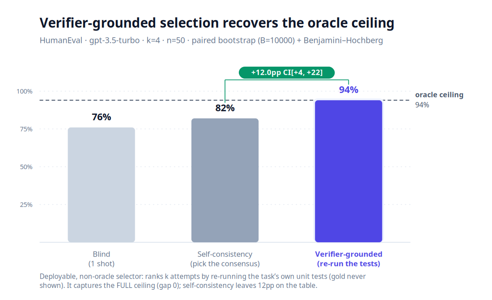
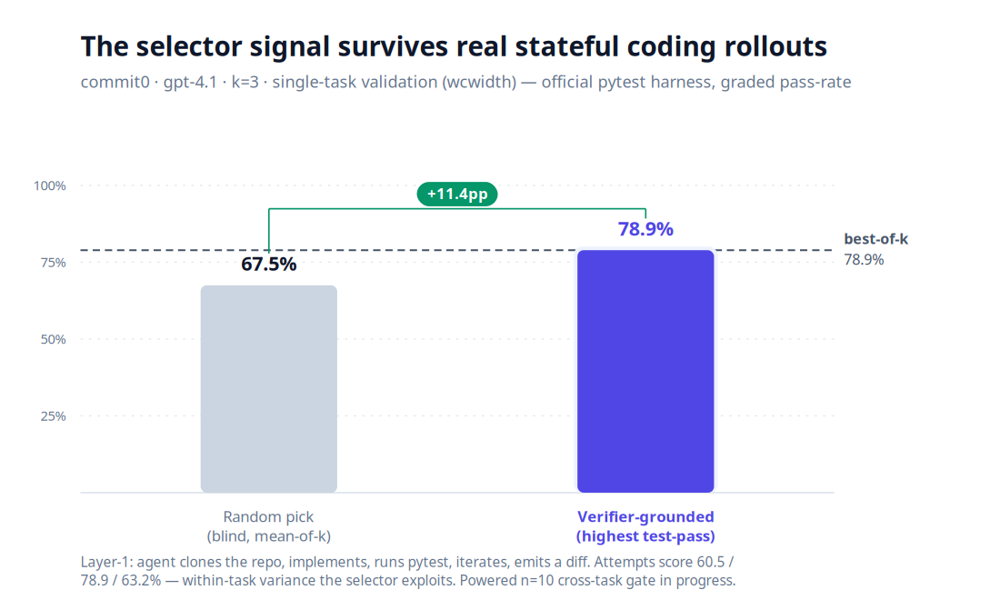

# Results — does a deployable checker beat blind compute?

The binding question (`docs/architecture.md` §2, `bench/HARNESS.md`): **at equal compute,
under a *deployable* (non-oracle) selector, on a domain with a correctable band — does any
non-blind topology beat blind sampling, at significant n?**

A **deployable** selector ranks the k attempts using only signal the agent could compute in
production — re-running the task's own tests — never the gold answer. That is the bar these
charts hold to.

## Verifier-grounded selection recovers the oracle ceiling (HumanEval)

Generate k=4 completions, then **re-run each one against the task's own unit tests** (gold never
shown) and keep the highest-passing. On HumanEval (gpt-3.5-turbo, n=50) this **captures the full
oracle ceiling — 94%, gap 0** — while self-consistency, the standard deployable selector, leaves
**12pp on the table** (`verifier − self-consistency = +12.0pp, CI[+4, +22]`, paired bootstrap +
Benjamini–Hochberg). The first admissible non-blind selection win.

## The signal survives real stateful coding rollouts (commit0)

HumanEval is Layer-0 (stateless completions). **commit0** is the Layer-1 test: the agent clones a
stubbed Python library, implements it, runs the test suite, iterates, and emits a diff — graded by
the official commit0 pytest harness to a continuous pass-rate. On `wcwidth` (k=3) the attempts score
60.5 / 78.9 / 63.2% — **within-task variance the verifier exploits** to pick the best
(`verifier − random = +11.4pp`). The powered **n=10 cross-task gate** is running; this chart updates
with it.

## The honest negative: the method needs a correctable band (aec-bench)

aec-bench (closed-form engineering calculations, gpt-4.1, n=12) is the control that proves the bar is
real, not rigged. Its `verify.py` is a legitimate deployable checker, and after fixing a worker
artifact the per-task scores rise to a 36% mean — yet the verifier-select gate is **+0.0pp**, because
**0/12 tasks have any within-task score variance**: a closed-form answer is deterministic w.r.t.
sampling, so there is nothing for any selector to choose between. The selector pays **only** where
attempts genuinely differ — code (HumanEval, commit0) — not where they don't (aec).

---

*Charts regenerate from the run outputs: `node bench/scripts/render-gate-chart.mjs`
(SVG source in `assets/`, PNG via `cairosvg`). Numbers are the real measured gate results, not
illustrations.*
