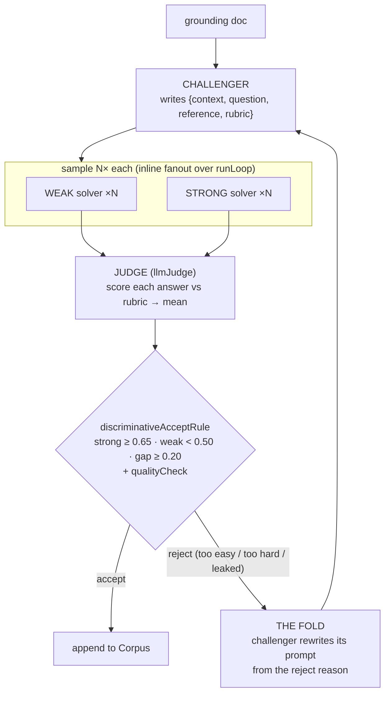

# agentic-data-creation

**An agent manufactures its own hard training data.** This is the INNER loop of **agentic
self-instruct** (the self-instruct pattern, Wang et al. 2022, taken agentic): instead of hand-writing examples, an agent
*writes* candidate {context, question, reference, rubric} examples from a grounding doc and keeps
only the ones that are **hard for a weak solver but doable for a strong one**. The hard ones are
exactly the examples worth training on.

> This example builds only the **data-creation** half (the inner loop). The RL-training
> outer half needs a trainer this repo does not have, so it is out of scope here.

Runs fully offline (scripted solvers + a mocked judge, no credentials):

```bash
pnpm tsx examples/agentic-data-creation/run.ts
```

## The four roles + one accept rule

Each round manufactures one example:

1. **Challenger** writes a candidate `{context, question, reference, rubric}` from the doc.
2. **Weak solver** and **Strong solver** each attempt it, sampled **N×** to average out variance.
3. **Judge** scores every attempt against the rubric (one `llmJudge` call per attempt → `[0,1]`).
4. **Accept** keeps the example **only if it discriminates** — the one new piece below — plus a
   quality check (the reference must not leak into the context; the rubric must have ≥ 2 criteria).

On reject, the challenger driver **folds** the reason into its next prompt and retries until the
example is accepted or its budget runs out. Accepted examples accrete into a `Corpus`.



## The one new piece — `discriminativeAcceptRule`

Everything else is composed from primitives this repo already ships. The genuinely new piece is the
accept rule, written as a small, Validator-shaped accept/reject:

```ts
discriminativeAcceptRule({ strongScore, weakScore, minStrong = 0.65, maxWeak = 0.5, minGap = 0.2 })
  → { accept, reason }
```

It accepts an example **only if** the strong solver mostly gets it (`strong ≥ minStrong`), the weak
solver mostly misses it (`weak < maxWeak`), and the margin clears `minGap`. That is the whole
objective — *make examples too hard for the weak solver* — so the rule stays the literal accept
criterion, never softened. Its three reject reasons (`too easy` / `too hard` / `leaked`) are exactly
what the challenger folds into its next prompt.

> **Lift candidate (not lifted yet).** This is a domain-free reward over two scores — the same shape
> as agent-eval's `blendHeldout` / `HeldOutGate`. If it proves out across real domains it is a
> candidate to lift INTO agent-eval as a reusable reward primitive. It lives here, in an example,
> until then.

## What plays each part (composed, not reinvented)

| Part of the method | Primitive used | Where |
|---|---|---|
| Challenger refine / **the fold** | `runLoop` + a refine `Driver` | mirrors `examples/driver-loop` |
| N× solver sampling | `runLoop` + an inline **fanout** driver (`plan` returns N task copies) | mirrors `examples/researcher-loop` |
| Score an answer vs a rubric | **`llmJudge`** (agent-eval) used as the loop `Validator` | `offline-fixtures.ts` |
| Cost accounting | `runLoop.costUsd` rolled into a **`CostLedger`**, split by role | `agentic-data-creation.ts` |
| Store of accepted examples | **`InMemoryCorpus`** (agent-runtime) | `agentic-data-creation.ts` |
| The accept rule | **`discriminativeAcceptRule`** (the one new piece) | `agentic-data-creation.ts` |

The four roles are **injected**, so `createDataCreationLoop` is domain-agnostic — point it at any doc
with any challenger/solvers/judge.

## Calibration — does the gap metric actually discriminate?

A gap metric is only a useful reward if it *separates* hard examples from easy ones. The run proves
this before trusting it (the `calibrate-before-measure` discipline): it measures the gap on the
challenger's **first (un-refined) draft** — plain generation — and on the **loop-accepted** example,
and shows the accept rule separates them. **Offline the solvers are scripted, so this proves the
wiring + that the rule discriminates by construction — it is NOT an empirical reproduction of the
illustrative target.** Reproducing that separation for real (the loop actually producing harder data) needs the
live run below, with real two-tier solver models:

```
plain   (first-draft examples)   mean gap ≈ 0.02   (scripted)
agentic (loop-accepted examples) mean gap ≈ 0.31   (scripted) →  rule fires; live run needed for the real number
```

If the two did NOT separate, the run says so — a gap metric that doesn't move between easy and hard
examples would be uninformative, and the loop would be optimizing noise.

## Offline vs live

`offline-fixtures.ts` is the credentialless stand-in (the same pattern `examples/driver-loop` and
`examples/self-improving-loop` use): deterministic scripted challenger/solvers and a **mocked judge
transport** bound into a *real* `llmJudge` `JudgeConfig`, tuned to the illustrative target separation. The judge,
sampler, fold, cost ledger, and corpus are all the real primitives — only the LLM responses are
scripted. To run live, swap the mock transport for `createChatClient({ transport: 'router', apiKey })`
(glm-5.2) and the scripted workers for real sandbox/cli-bridge clients; the loop is unchanged.

## Where this goes next

- `examples/driver-loop/` — the fold in isolation (the move the challenger loop is built on).
- `examples/researcher-loop/` — the inline fanout driver in isolation (the N× sampler).
- `examples/self-improving-loop/` — the same `llmJudge` + paired-gate primitives, applied to
  improving an agent's profile rather than manufacturing data.
