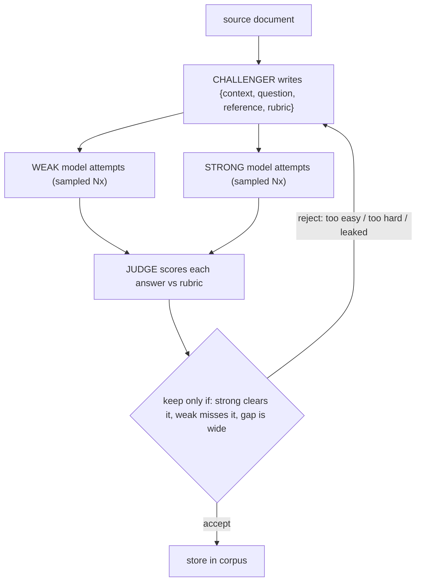

# An AI that writes its own hard training data

Good training data is expensive to hand-write. This example shows an AI **manufacturing** it: an
agent reads a source document, invents a question-and-answer example from it, and keeps the example
**only if it's hard for a weak model but solvable for a strong one**. Those are precisely the
examples worth training on — too easy teaches nothing, too hard is unlearnable, but the ones in
between, where a strong model pulls ahead of a weak one, are where learning happens.

It runs fully offline — no API key, no network:

```bash
pnpm tsx examples/agentic-data-creation/run.ts
```

## Why it matters

This is the data-making half of **self-instruct** (an AI generating its own training set instead of
using hand-written examples). The hard part isn't generating questions — anything can do that — it's
the *filter*. A useful training example must **discriminate**: a strong model should mostly get it, a
weak model should mostly miss it, and the gap between them must be real. This example makes that
filter the literal accept rule, so every example that survives is, by construction, informative.

> This builds only the **data-creation** loop. Actually training a model on the resulting data needs
> a trainer that isn't in this repo, so that step is out of scope here.

## How one example gets made

Each round manufactures one candidate and either keeps or rejects it:

1. **Challenger** — an agent writes a candidate example from the source doc: a context passage, a
   question, a reference answer, and a grading rubric.
2. **Two solvers attempt it** — a deliberately weak model and a strong model each try to answer,
   sampled several times so a lucky guess doesn't skew the score.
3. **Judge** — a model scores each answer against the rubric, producing a number from 0 to 1.
4. **Accept or reject** — keep the example only if the strong solver clears it, the weak solver
   mostly misses it, and the gap is wide enough (plus a sanity check: the answer must not be leaked
   into the context, and the rubric must have at least two criteria).

On reject, the challenger is told **why** (`too easy` / `too hard` / `leaked`) and rewrites its next
attempt from that reason — so it learns to aim for the hard-but-solvable band. Accepted examples pile
up into a stored corpus a downstream trainer can read back.



## The one rule that does the work

The accept criterion is a small pass/fail function you can read in one line:

```ts
discriminativeAcceptRule({ strongScore, weakScore, minStrong = 0.65, maxWeak = 0.5, minGap = 0.2 })
  → { accept, reason }
```

Accept an example only if the strong solver mostly gets it (`strong ≥ 0.65`), the weak solver mostly
misses it (`weak < 0.5`), and the margin between them clears `0.2`. That *is* the whole objective —
"make examples too hard for the weak model" — so the rule stays the literal filter, never softened.
Its three reject reasons are exactly what the challenger folds into its next attempt.

## Does the filter actually separate hard from easy?

A gap-based filter is only useful if the gap it measures actually moves between easy and hard
examples. So the run checks this before trusting it: it measures the gap on the challenger's **first
raw draft** (plain generation) versus the **loop-accepted** example, and shows they separate.

```
plain   (first-draft examples)   mean gap ≈ 0.02
agentic (loop-accepted examples) mean gap ≈ 0.31   → the rule fires
```

**Important honesty note:** offline, the models are scripted stand-ins, so this proves the *wiring*
and that the rule discriminates *by construction* — not that a live loop produces genuinely harder
data. That empirical claim needs the live run below with two real models of different strength.

## Running it for real

`offline-fixtures.ts` provides the credential-free stand-ins: scripted challenger and solvers, and a
mocked judge model. Everything else — the sampler, the reject-and-retry, the cost accounting, the
corpus — is the real machinery; only the model responses are fake. To go live, swap the mocked
transport for a real model client and the scripted solvers for two real models (one weak, one
strong). The loop itself doesn't change.

## Files

| file | what it is |
|---|---|
| `run.ts` | the entrypoint: runs the offline loop and prints accepted examples, the calibration, and cost |
| `agentic-data-creation.ts` | `createDataCreationLoop` (domain-agnostic — point it at any doc) + the accept rule + cost/corpus wiring |
| `offline-fixtures.ts` | the credential-free scripted challenger/solvers and mocked judge |
| `agentic-data-creation.test.ts` | offline smoke test |
