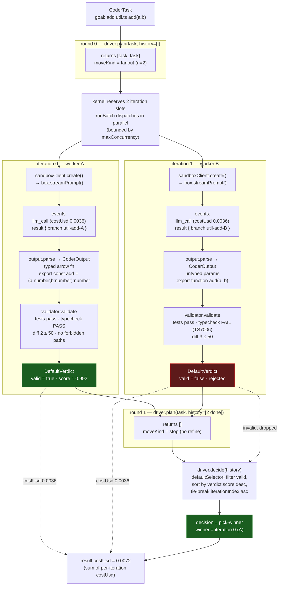

# coder-loop

`coderProfile()` + `runLoop()` + `createFanoutVoteDriver()` — the smallest
end-to-end coder loop. Two parallel iterations attempt the same goal; the
validator scores test + typecheck + diff size; the kernel picks the
highest-scoring valid winner.

## Topology

`createFanoutVoteDriver({ n: 2 })` is a single-round fanout: `plan()` returns
`n` copies of the task only when `history` is empty (round 0), then `[]`
forever after — it spawns N, scores, and picks; it never refines. Each of the
N tasks becomes its own iteration, and every iteration runs the same
`output.parse` → `validator.validate` pipeline independently before the driver
votes.



## Run

```bash
pnpm tsx examples/coder-loop/coder-loop.ts
```

## What it shows

- How `coderProfile({ task, harness })` bundles `profile`, `taskToPrompt`,
  `output` (event-stream → `CoderOutput`), `validator` (test + typecheck +
  diff cap + forbidden-path enforcement), and `agentRunSpec` together.
- How `createFanoutVoteDriver({ n })` makes the kernel plan N parallel
  iterations and pick the winning output.
- How the synthetic `sandboxClient` mirrors the production
  `@tangle-network/sandbox` `Sandbox` surface — swap it for `new Sandbox(...)`
  when you wire to production.
- How `result.winner` carries the typed `CoderOutput`, the verdict, and the
  iteration index — everything you need to merge the patch in CI.

## Wire to production

Swap the synthetic `sandboxClient` for:

```ts
import { Sandbox } from '@tangle-network/sandbox'

const sandboxClient = new Sandbox({ apiKey: process.env.TANGLE_API_KEY! })
```

Then `runLoop` creates a fresh sandbox per iteration via `sandboxClient.create()`
and streams the prompt through `box.streamPrompt(taskToPrompt(task))`. Each
iteration's events feed the same `output.parse` → `validator.validate`
pipeline.
