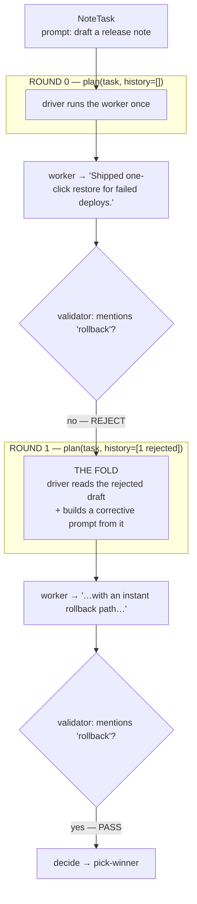

# driver-loop

**See the fold.** This is the single most important example in the set: a driver that
*reads the last worker's output and writes the next instruction from it*. That read-then-rewrite
move — "the fold" — is what every supervisor in this repo is built on. Once you've seen it here,
`supervise()`, the coordination MCP, and the self-improvement loop all read as variations of it.

Runs fully offline (a scripted worker, no credentials):

```bash
pnpm tsx examples/driver-loop/driver-loop.ts
```

## Vocabulary

These words are used across every example and defined here.

| Term | Meaning |
|---|---|
| **round** | One full driver cycle: `plan → run workers → decide`. The `runLoop` kernel runs exactly this, once per round. |
| **shot** | One independent worker attempt/sample. A single round can run many shots (a fanout). |
| **multishot** | N shots played in parallel. |
| **sample** | A strategy: take the best of N shots (breadth). |
| **refine** | A strategy: iterate-with-critique *across rounds* (depth) — what SECTION 1 of this example does. |

## What the example shows

**SECTION 1 — ROUNDS (refine), the centerpiece.** A multi-round driver:

- **Round 0** — `driver.plan(task, history=[])`: no history yet, so it runs the worker once. The
  worker drafts a release note but forgets a required word, so the validator **rejects** it.
- **Round 1** — `driver.plan(task, history=[1 rejected])`: the driver READS the rejected draft
  and its verdict out of `history`, then COMPOSES a corrective prompt *from that output* ("your
  draft was X, it was rejected because Y — rewrite it to mention Z"). The worker obeys the new
  prompt and the validator **passes**.

The two load-bearing lines in `driver-loop.ts` are commented `THE FOLD, PART 1: INGEST` (where it
reads `history[history.length-1].output`) and `THE FOLD, PART 2: GENERATE` (where it builds the
next prompt). In production a router LLM does that composition — it reads the folded worker output
from its tool-result messages and writes the next spawn's prompt. Here it's plain code so the seam
is visible.



**SECTION 2 — SHOTS (multishot), the contrast.** Three independent attempts at the same task,
in parallel, with **no fold between them**. This is the *other* axis: a round refines depth-wise
(each round improves on the last); a shot explores breadth-wise (many tries at once). Seeing them
side by side is the cleanest way to internalize round vs shot.

## Where this goes next

- `examples/supervise/` — the one-call `supervise(profile, goal)` where a router LLM does the fold
  for you.
- `examples/supervisor-loop/` — the same supervisor over a real worker backend (sandbox box /
  local cli-bridge), worker backend as the only knob.
- `examples/researcher-loop/` and `examples/ui-audit/` — `runLoop` drivers that are *single-round*
  and *content-blind* on purpose (they never fold); read those to see the contrast with this one.
