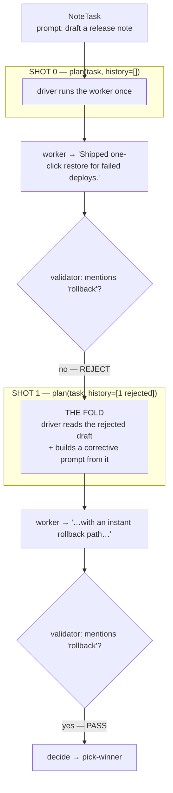

# driver-loop

**See the fold.** This is the single most important example in the set: a driver that
*reads the last worker's output and writes the next instruction from it*. That read-then-rewrite
move — "the fold" — is what every supervisor in this repo is built on. Once you've seen it here,
`supervise()`, the coordination MCP, and the self-improvement loop all read as variations of it.

Runs fully offline (a scripted worker, no credentials):

```bash
pnpm tsx examples/driver-loop/driver-loop.ts
```

## Vocabulary

These words are used across every example. The key thing: **a shot, a round, and a turn are the
same atom** — one driver↔worker exchange. "Many shots" is the *sequence* of them, not a fanout.

| Term | Meaning |
|---|---|
| **shot** = **round** = **turn** | ONE driver↔worker exchange: `driver ──prompt──▶ worker ──output (+traces/analysis)──▶ driver`. (`runLoop` increments a "round"; the multi-turn conversation primitive calls it a "turn"; people say "shot". Same atom.) |
| **the loop** (*"many shots"*) | A **sequence** of shots where each output **folds** into the next prompt: `prompt0 ▶ worker ▶ output0 ▶ driver ▶ prompt1 ▶ worker ▶ …`. Each shot builds on the last. **This example.** |
| **refine** | The strategy this file uses: keep taking shots, folding the last output into the next prompt, until a check passes (depth). |
| **fanout** (*best-of-N*) | A **different** axis: N *independent* shots with **no fold** between them, keep the best (breadth). This is **not** "many shots" in the looping sense — see `examples/researcher-loop`. |

## What the example shows

A multi-shot **refine** driver:

- **Shot 0** — `driver.plan(task, history=[])`: no history yet, so it runs the worker once. The
  worker drafts a release note but forgets a required word, so the validator **rejects** it.
- **Shot 1** — `driver.plan(task, history=[1 rejected])`: the driver READS the rejected draft
  and its verdict out of `history`, then COMPOSES a corrective prompt *from that output* ("your
  draft was X, it was rejected because Y — rewrite it to mention Z"). The worker obeys the new
  prompt and the validator **passes**.

The two load-bearing lines in `driver-loop.ts` are commented `THE FOLD, PART 1: INGEST` (where it
reads `history[history.length-1].output`) and `THE FOLD, PART 2: GENERATE` (where it builds the
next prompt). In production a router LLM does that composition — it reads the folded worker output
from its tool-result messages and writes the next spawn's prompt. Here it's plain code so the seam
is visible.



**Shot vs fanout (the other axis).** This file refines *depth*-wise: each shot improves on the
last by folding its output forward. The orthogonal move is *breadth* — fire N independent shots at
once with no fold between them and keep the best (a fanout / best-of-N). That's a different example:
see `examples/researcher-loop`, whose driver is single-round and content-blind on purpose.

## Where this goes next

- `examples/supervise/` — the one-call `supervise(profile, goal)` where a router LLM does the fold
  for you.
- `examples/supervisor-loop/` — the same supervisor over a real worker backend (sandbox box /
  local cli-bridge), worker backend as the only knob.
- `examples/researcher-loop/` — a `runLoop` driver that is *single-round* and *content-blind* on
  purpose (a fanout, never a fold); read it to see the breadth axis next to this file's depth axis.
