# fleet-delegation

How `TANGLE_FLEET_ID` flips `agent-runtime-mcp` from sibling-sandbox
dispatch into fleet-workspace dispatch.

## Run

```bash
pnpm tsx examples/fleet-delegation/fleet-delegation.ts
```

## Sibling vs Fleet

```
Sibling                          Fleet
──────                           ─────
parent sandbox                   coordinator-0  (excluded)
   │                                │
   │ delegate_*                     │ delegate_*
   ▼                                ▼
fresh sibling                    worker-a  ←─┐
fresh sibling                    worker-b  ←─┤  round-robin
fresh sibling                    worker-c  ←─┘
                                   │
                                   └─ all three share the same fleet
                                      workspace; diffs land on the
                                      coordinator's FS in place
```



```mermaid
flowchart TD
    subgraph SIBLING["SIBLING mode — no TANGLE_FLEET_ID"]
        S_parent["parent sandbox<br/>createSiblingSandboxExecutor(client)"]
        S_d0["delegate_* #0"]
        S_d1["delegate_* #1"]
        S_d2["delegate_* #2"]
        S_b0["fresh sibling<br/>client.create()"]
        S_b1["fresh sibling<br/>client.create()"]
        S_b2["fresh sibling<br/>client.create()"]
        S_parent --> S_d0 & S_d1 & S_d2
        S_d0 -->|"1:1 spawn"| S_b0
        S_d1 -->|"1:1 spawn"| S_b1
        S_d2 -->|"1:1 spawn"| S_b2
        S_tag(["loop.iteration.dispatch<br/>{ placement: 'sibling', sandboxId }"])
        S_b0 -.-> S_tag
        S_b1 -.-> S_tag
        S_b2 -.-> S_tag
        S_note["no shared filesystem —<br/>output returns via MCP response"]
        S_tag -.-> S_note
    end

    subgraph FLEET["FLEET mode — TANGLE_FLEET_ID set"]
        F_coord["coordinator-0<br/>(EXCLUDED via excludeMachineIds)"]
        F_sel{"round-robin selector<br/>fleet.ids ∖ exclude set"}
        F_d0["delegate_* #0"]
        F_d1["delegate_* #1"]
        F_d2["delegate_* #2"]
        F_wa["worker-a"]
        F_wb["worker-b"]
        F_wc["worker-c"]
        F_coord -.->|"skipped"| F_sel
        F_coord --> F_d0 & F_d1 & F_d2
        F_d0 --> F_sel
        F_d1 --> F_sel
        F_d2 --> F_sel
        F_sel -->|"#0"| F_wa
        F_sel -->|"#1"| F_wb
        F_sel -->|"#2"| F_wc
        F_ws[("shared fleet workspace<br/>diffs land in-place on coordinator FS")]
        F_wa --> F_ws
        F_wb --> F_ws
        F_wc --> F_ws
        F_tag(["loop.iteration.dispatch<br/>{ placement: 'fleet', fleetId, machineId, sandboxId }"])
        F_wa -.-> F_tag
        F_wb -.-> F_tag
        F_wc -.-> F_tag
    end
```

- **Sibling** (default): each `delegate` call spawns a fresh sandbox via
  `sandboxClient.create()`. Worker output flows back through the MCP
  response — there is no shared filesystem.
- **Fleet** (set `TANGLE_FLEET_ID`): each delegation lands on an existing
  machine in the parent fleet. The fleet's shared-workspace policy means
  the worker sees the caller's filesystem and any diff lands in-place.

## Env wiring

```bash
TANGLE_API_KEY=sk_sb_*                       # required in both modes
SANDBOX_BASE_URL=https://sandbox.tangle.tools

# Sibling mode (default) — omit TANGLE_FLEET_ID

# Fleet mode
TANGLE_FLEET_ID=<fleet-id-the-parent-sandbox-runs-in>
TANGLE_FLEET_EXCLUDE_MACHINES=coordinator-0  # comma-separated; skip the
                                             # coordinator machine the
                                             # MCP server itself runs on
```

The bin (`src/mcp/bin.ts`) reads these at startup. When `TANGLE_FLEET_ID`
is set, it constructs a `SandboxFleet` handle via the SDK and passes it
into `createFleetWorkspaceExecutor` (see `src/mcp/executor.ts`); otherwise
it wraps the bare `Sandbox` client in `createSiblingSandboxExecutor`. The
selector used to pick the worker machine round-robins across the eligible
machine ids, skipping any in the exclude set.

## Trace correlation

`loop.iteration.dispatch` events carry the placement tag the executor
reports — `sibling` mode emits `{ placement: 'sibling', sandboxId }`;
fleet mode emits `{ placement: 'fleet', fleetId, machineId, sandboxId }`.
Downstream trace pipelines correlate worker logs back to the dispatch
this way.

## See also

- [`mcp-delegation`](../mcp-delegation/) — how a product mounts the MCP
  server entry in its AgentProfile + a smoke that exercises tools/list
- `src/mcp/executor.ts` — the production executor factories
- `src/mcp/bin.ts` — the stdio MCP entry point that wires the env above
