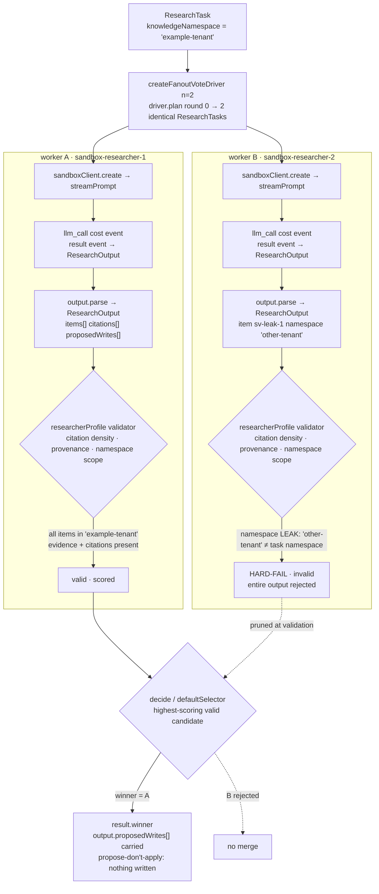

# researcher-loop

`researcherProfile()` + `runLoop()` + `createFanoutVoteDriver()` — the
researcher-flavoured counterpart to [`coder-loop`](../coder-loop). Two
parallel researcher iterations attempt the same question; the validator
scores citation density + namespace scoping + per-item provenance; the
kernel picks the highest-scoring valid winner.

Same `runLoop` fanout-vote kernel as [`coder-loop`](../coder-loop), only the
profile differs. The load-bearing branch below is candidate B: it leaks an
item into `other-tenant`, so the validator hard-fails the entire output and
the kernel prunes it — leaving A as the sole winner.



## Run

```bash
pnpm tsx examples/researcher-loop/researcher-loop.ts
```

The `@tangle-network/agent-knowledge` peer dep ships in `node_modules`
already; the example imports `researcherProfile` from
`@tangle-network/agent-knowledge/profiles`.

## What it shows

- How `researcherProfile({ task })` bundles the canonical knowledge-research
  preset (system prompt, validator, output adapter) with an
  `AgentRunSpec<ResearchTask>` the kernel consumes.
- How the validator hard-fails namespace leaks: the second synthetic
  iteration emits an item under `other-tenant` instead of
  `task.knowledgeNamespace`, and the kernel rejects it.
- How `result.winner.output` carries `items[]` + `citations[]` +
  `proposedWrites[]` — the propose-don't-apply contract the knowledge
  substrate enforces.

## Wire to production

Swap the synthetic `sandboxClient` for `new Sandbox({ apiKey })` and the
kernel creates a real sandbox per iteration, streams the researcher prompt
through `box.streamPrompt(taskToPrompt(task))`, and parses the canonical
`result` event payload via `researcherProfile().output.parse`.
