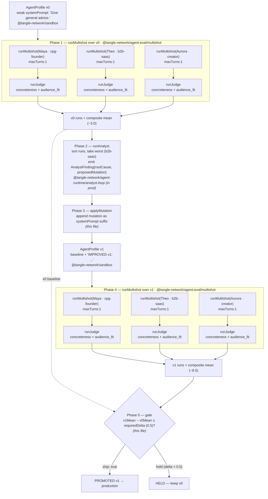

# self-improving-loop

The v0 → judge → analyst → mutation → v1 → gate cycle in one runnable file:
`@tangle-network/agent-eval`'s multishot + judge primitives driven from this
package, with the `@tangle-network/sandbox` `AgentProfile` type as the shared
contract. The analyst and gate are hand-rolled inline so the demo is
deterministic and offline — in production, use `selfImprove` from
`@tangle-network/agent-eval` for text-surface optimization, or
`runStrategyEvolution` + `promotionGate` from
`@tangle-network/agent-runtime/loops` for strategy/topology optimization (see
[`examples/strategy-suite/`](../strategy-suite/)).

## What it shows

The 7-phase evolution loop in `self-improving-loop.ts`. Each phase is annotated with the substrate package that owns it (per the *Where each substrate piece lives* table below). The load-bearing join is the gate: it compares the v0 and v1 means and is the only thing that decides whether the mutation ships.



This is the loop every product wires for evolution — the substrate makes each piece composable, this example shows them snapping together.

## Run

```bash
pnpm tsx examples/self-improving-loop/self-improving-loop.ts
```

Default mode runs offline with scripted LLM responses so the demo is reproducible. To run live against the Tangle router:

```bash
TANGLE_API_KEY=sk-tan-... MOCK=0 pnpm tsx examples/self-improving-loop/self-improving-loop.ts
```

## Expected output

```
═══ self-improving-loop demo ═══

— Phase 1: v0 baseline run
  v0 mean: 3.00 (over 3 personas)
    cpg-founder    composite=3.50
    b2b-saas       composite=2.50
    creator        composite=3.50

— Phase 2: analyst proposes mutation
  root cause: b2b-saas run scored 2.5 — output was too generic, no concrete posts.
  mutation:   Always include 2 ready-to-post examples tailored to the persona's exact domain...

— Phase 3: apply mutation → v1 profile

— Phase 4: v1 re-run
  v1 mean: 8.50 (over 3 personas)
    cpg-founder    composite=8.50
    b2b-saas       composite=8.50
    creator        composite=8.50

— Phase 5: gate decision
  ship: true | delta: +5.50 | v1 beat v0 by 5.50 (>= 0.5)

═══ PROMOTED v1 → production ═══
```

## Where each substrate piece lives

| Phase | Substrate | What it does |
|---|---|---|
| 1, 4 | `@tangle-network/agent-eval/multishot` `runMultishot` | Multi-turn driver-agent loop + inline tool execution |
| 1, 4 | `@tangle-network/agent-eval/multishot` `runJudge` | Generic 0-10 dimensional scorer with JSON parsing |
| 1-7 | `@tangle-network/sandbox` `AgentProfile` | The substrate type that flows unwrapped through the entire loop |
| 2 | `@tangle-network/agent-runtime/analyst-loop` `runAnalystLoop` | Real product analyst — reads traces, finds patterns, proposes mutations (mocked here for reproducibility) |
| 3 | (this file) `applyMutation` | Domain-specific — typically a systemPrompt suffix or a tool addition |
| 5 | (this file) `gate` | Domain-specific — products usually use `evaluateReleaseConfidence` from agent-eval with a held-out set + threshold |

## How this maps to a real product

In a real product, this loop runs as a scheduled job (the `production-loop` CI cron):

1. Production traces accumulate in `.production-data/traces/` via the ingestion mount (`@tangle-network/agent-runtime/wire`).
2. The analyst loop reads them → finds failure clusters → produces typed findings.
3. The reflective mutator (`@tangle-network/agent-eval/optimization`) generates N candidate mutations from those findings.
4. `runMultishotMatrix` evaluates each candidate against the same persona × judge set.
5. `evaluateReleaseConfidence` compares against the held-out baseline.
6. If it ships, the new profile lands in the production composer as a PR — human reviews + merges.

See `agent-stack-adoption` skill ([dotfiles](https://github.com/drewstone/dotfiles/blob/main/claude/skills/agent-stack-adoption/SKILL.md)) for the end-to-end 10-phase runbook.
